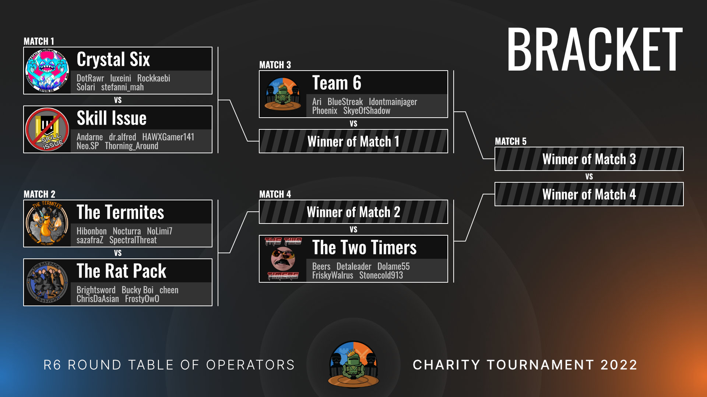
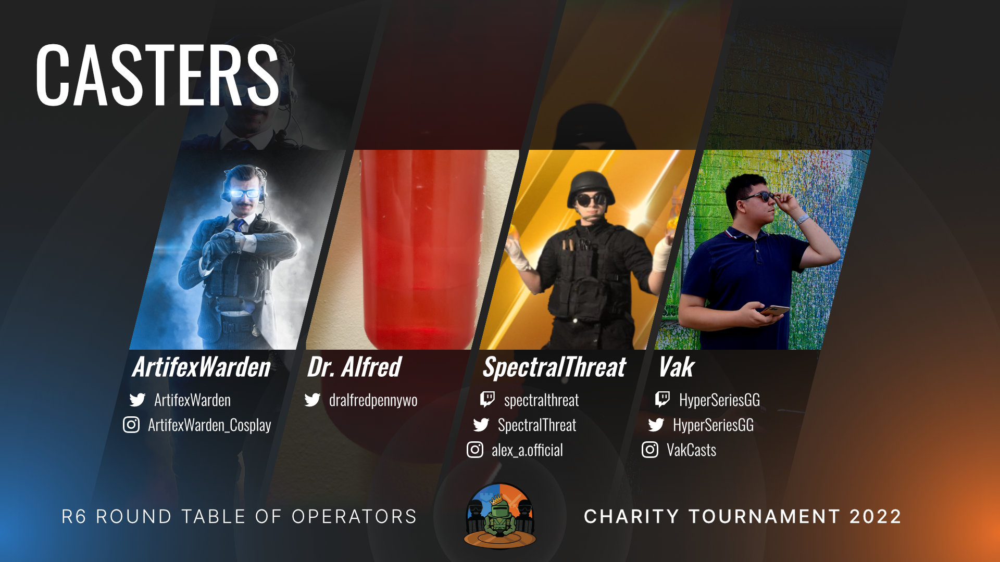
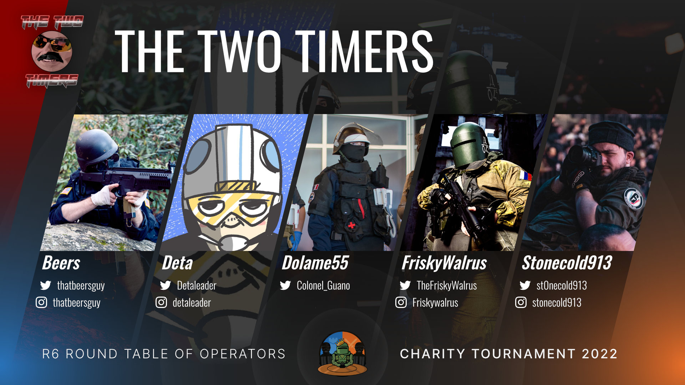
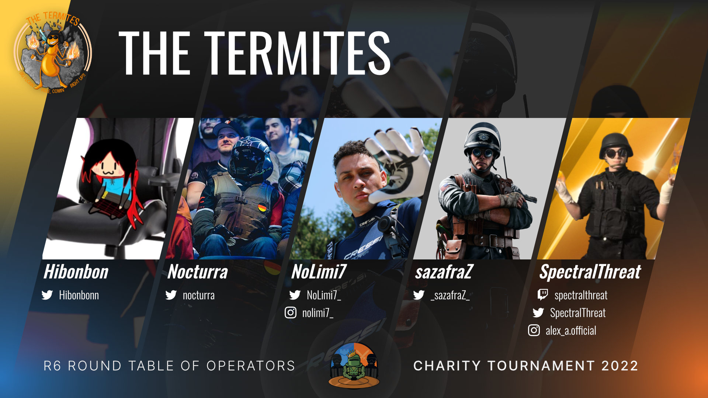
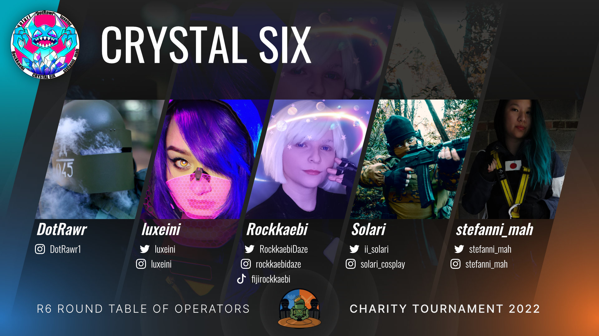
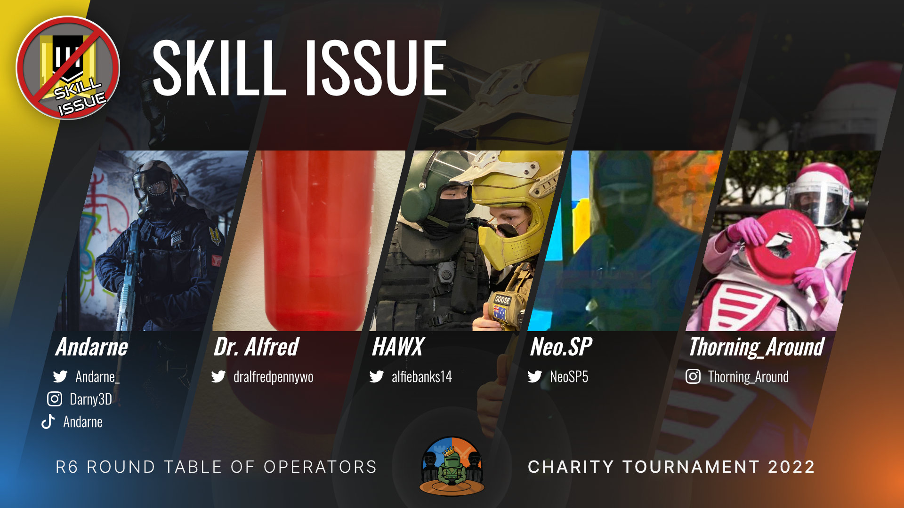
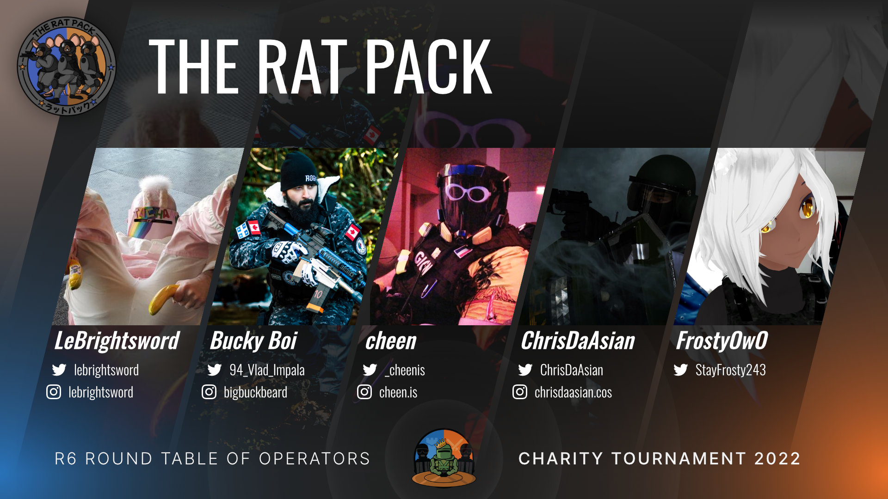
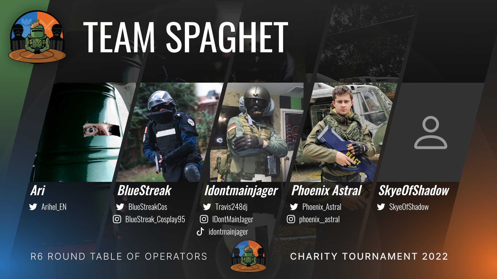

{:.lead .info}
The tournament has ended, with $2,570.65 raised for Child's Play! Thank you for joining us, and see you next time! 

----

Join us as Rainbow Six cosplayers battle it out in the R6 Round Table of Operators' **Charity Tournament 2022**, while raising funds for Child's Play charity!

* Proceeds will go to Child's Play charity
* Prizes made by the community will be raffled off to donators during the event
* There may be other additional bonuses... 👀

## Schedule

Matches will be played over two days, from April 16 to 17, starting at 10am Eastern Time! 

<strong>Day 1</strong> 
2022-04-16T10:00:00-04:00 
starting at 2022-04-16T10:00:00-04:00

<strong>Day 2</strong> 
2022-04-17T10:00:00-04:00 
starting at 2022-04-17T10:00:00-04:00

## Join us!

<ul class="link-collection">
    <li class="link">
        <a href="https://www.twitch.tv/RoundTableOfOperators">
            

                
Watch the stream

            

            

                
Follow twitch.tv/RoundTableOfOperators

            

        </a>
    </li>
    <li class="link">
        <a href="https://tiltify.com/@roundtabler6/round-table-major">
            

                
Donate to Child's Play

            

            

                
via Tiltify

            

        </a>
    </li>
</ul>

----

## Bracket

{:.wide}

Text transcription of bracket

The bracket for the tournament! Starting with matches 1 and 2:

MATCH 1: Crystal Six vs Skill Issue

MATCH 2: The Termites vs The Rat Pack

Followed by...

MATCH 3: Team 6 vs winner of Match 1

MATCH 4: The Two Timers vs winner of Match 2

And the finals...

MATCH 5: winner of Match 3 vs winner of Match 4

## Participants

### Casters

[ArtifexWarden](https://twitter.com/ArtifexWarden) &bull; [Dr. Alfred](https://twitter.com/dralfredpennywo) &bull; [SpectralThreat](https://twitch.tv/spectralthreat) &bull; [Vak](https://www.twitch.tv/HyperSeriesGG)

### Team 1: The Two Timers

[Beers](https://twitter.com/thatbeersguy) &bull; [Deta](https://twitter.com/Detaleader) &bull; [Dolame55](https://twitter.com/Colonel_Guano) &bull; [FriskyWalrus](https://twitter.com/thefriskywalrus) &bull; [Stonecold913](https://twitter.com/st0necold913)

### Team 2: The Termites

[Hibonbon](https://twitter.com/Hibonbonn) &bull; [Nocturra](https://twitter.com/nocturra) &bull; [sazafraZ](https://twitter.com/_sazafraZ_) &bull; [NoLimi7](https://twitter.com/NoLimi7_) &bull; [SpectralThreat](https://twitch.tv/spectralthreat)

### Team 3: Crystal Six

[DotRawr](https://www.instagram.com/dotrawr1) &bull; [luxeini](https://twitter.com/luxeini) &bull; [Rockkaebi](https://twitter.com/RockkaebiDaze) &bull; [Solari](https://instagram.com/solari_cosplay) &bull; [stefanni_mah](https://twitter.com/stefanni_mah)

### Team 4: Skill Issue

[Andarne](https://twitter.com/Andarne_) &bull; [Dr. Alfred](https://twitter.com/dralfredpennywo) &bull; [HAWX](https://twitter.com/alfiebanks14) &bull; [Neo.SP](https://twitter.com/NeoSP5) &bull; [Thorning_Around](https://instagram.com/thorning_around)

### Team 5: The Rat Pack

[LeBrightsword](https://www.instagram.com/lebrightsword/) &bull; [Bucky Boi](https://twitter.com/94_Vlad_Impala) &bull; [cheen](https://twitter.com/_cheenis) &bull; [ChrisDaAsian](https://twitter.com/ChrisDaAsian) &bull; [FrostyOwO](https://youtube.com/channel/UCwhGuY86PoV_cSLtUvaDd_w)

### Team 6: Team Spaghet

[Ari](https://twitter.com/Arihel_EN) &bull; [BlueStreak](https://instagram.com/bluestreak_cosplay95) &bull; [Idontmainjager](https://tiktok.com/@idontmainjager) &bull; [Phoenix Astral](https://twitter.com/Phoenix_Astral) &bull; [SkyeOfShadow](https://twitter.com/SkyeOfShadow)

## Format

Matches will be played on Pro League rules, best of 3 rounds. 

Map pool:
* Plane
* House
* Fortress
* Border
* Tower
* Theme Park
* Bank
* Coastline
* Kafe Dostoyevsky 

-----

Background art by Luxeini!

<!-- Scripts for conversion to local time -->

